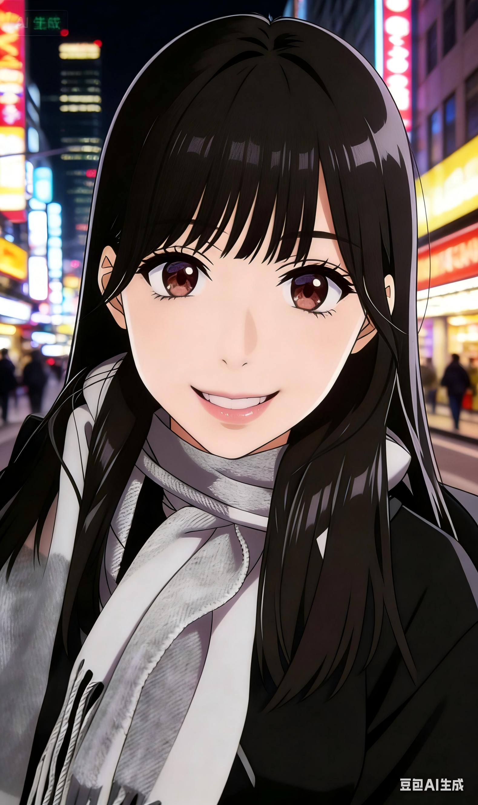

# Gongzhao6666.github.io    
<!DOCTYPE html>
<html lang="zh-CN">  
<head>  
    <meta charset="UTF-8">  
    <meta name="viewport" content="width=device-width, initial-scale=1.0">
    <title>龚照的小主页</title>
    
</head>
<body>
    

        <!-- 双语切换 -->
        

            <button class="lang-btn" onclick="showZh()">中文</button>
            <button class="lang-btn" onclick="showEn()">English</button>
        

        <!-- 头像区域 -->
        

            
        

        <h1>龚照</h1>
        
阳光活泼 · 可爱随性 · 积极向上

        <!-- 中文内容 -->
        

            

                <h3>✨ 关于我</h3>
                
我是龚照，性格活泼可爱、随性开朗。

                
就读于华东政法大学，专业为司法会计，辅修法学，深耕法商融合领域，手握会计技能与法律思维双重buff，逻辑严谨、专业过硬，英语六级已顺利通过。

                
简单来说：会算账、懂法律、不迷路，正经学习，快乐生活～

                
口头禅：妙哉妙哉，好哉好哉

                
最爱表情包：我已急哭，都怪美国

            

            

                <h3>🎖 在校职务</h3>
                
最飒文艺委员（整条街最靓的那种）

            

            

                <h3>💤 擅长的事</h3>
                
擅长睡觉、品尝美食

            

            

                <h3>🍜 最爱吃的</h3>
                
文汇路·Alcoholics酒摊摊（酸汤水饺）、湖南土菜

            

            

                <h3>🌍 想去的国家</h3>
                
日本 / 韩国

            

            

                <h3>⚽ 喜欢的球队</h3>
                
拜仁，巴萨，上海海港（呀不对，是上港！），武汉三镇

            

            

                <h3>😫 最讨厌的事情</h3>
                
开学 和 周一

            

            

                <h3>🌟 个人风格</h3>
                
活泼随性

            

        

        <!-- 英文内容（全双语适配） -->
        

            

                <h3>✨ About Me</h3>
                
I'm Gong Zhao. Lively, cute, easy-going and positive.

                
East China University of Political Science and Law, major in Forensic Accounting, minor in Law. I have both accounting skills and legal thinking, with rigorous logic and professional competence. Passed CET-6.

                
In short: I do accounting, know law, study hard and live happily~

                
Catchphrase: Wonderful, marvelous

                
Favorite meme: I'm crying anxiously, it's all America's fault

            

            

                <h3>🎖 Position</h3>
                
The Coolest Literature and Art Committee Member

            

            

                <h3>💤 Things I'm Good At</h3>
                
I'm good at sleeping, eating delicious food, and hanging out with Mr. F!

            

            

                <h3>🍜 Favorite Food</h3>
                
Wenhui Road · Alcoholics Bar (Sour Soup Dumplings), Hunan Dishes

            

            

                <h3>🌍 Countries I Want to Visit</h3>
                
Japan / South Korea

            

            

                <h3>⚽ Favorite Football Team</h3>
                
Bayern,FCB,Shanghai Port (Oops, it's Shanghai SIPG!),WH

            

            

                <h3>😫 Things I Hate</h3>
                
School Opening & Monday

            

            

                <h3>🌟 Personal Style</h3>
                
Lively and Casual

            

        

    

    
</body>
</html>
